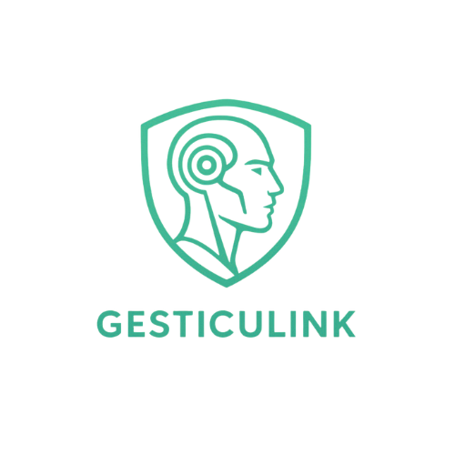

<p align="center">
  
</p>

# GESTICULINK

**Cabeza Animatrónica GESTICULINK**  
Repositorio oficial del proyecto GESTICULINK, un sistema capaz de imitar gestos humanos en tiempo real mediante el uso de microcontroladores, reconocimiento facial y una interfaz web.

---

## 📂 Estructura del Repositorio

El repositorio está organizado en cuatro carpetas principales:

- [Microcontrolador](/Microcontrolador) → Contiene los códigos para el control del hardware y la animatrónica.  
- [ReconocimientoFacial](/ReconocimientoFacial)  → Implementación del sistema de visión por computadora para detectar gestos y expresiones faciales.  
- [ReconocimientoVoz](/ReconocimientoVoz)  → Sistema de conversación con IA integrada (Gemini 2.5 Flash) para interacción por voz.
- [PaginaWeb](/PaginaWeb)  → Código de la interfaz web para monitoreo y control del sistema.  

---

## 🚀 Características

- Integración de hardware (microcontrolador) con software de reconocimiento facial.  
- Sistema de reconocimiento de voz con IA integrada (Gemini 2.5 Flash) para conversación natural.  
- Comunicación en tiempo real entre los módulos.  
- Interfaz web mejorada para visualización, control e interacción por voz.  
- Mejoras en la detección de emociones y gestos faciales.  
- Sistema que permite tanto control automático (por gestos) como interacción conversacional.  

---

## 🛠️ Uso del Repositorio

Puedes clonar este repositorio y vincularlo a **Visual Studio Code** para un entorno de desarrollo más cómodo.  
También puedes aprovechar herramientas como **GitHub Copilot** o **ChatGPT** para optimizar el flujo de trabajo y colaborar mediante **Pull Requests**.
popo
```bash
git clone https://github.com/HantigoZore/GESTICULINK.gi
````

## 📌 Estado de la Rama

* Página web mejorada con nuevo modo de interacción por voz.
* Sistema completo de reconocimiento facial con detección de emociones.
* Integración de IA conversacional usando Gemini 2.5 Flash para interacción natural.
* Mejoras en la precisión del reconocimiento facial.
* Actualización de la imagen de la cabeza animatrónica.
* Incorporación de la página web.
* Integración del sistema de reconocimiento facial.

---

## 🤝 Contribución

Las contribuciones son bienvenidas. Puedes abrir un **issue** para reportar problemas o proponer mejoras, y enviar un **pull request** con tus cambios.

---

## 📄 Licencia

Este proyecto se distribuye bajo la licencia **MIT**.
Consulta el archivo [LICENSE](LICENSE) para más detalles.

## 🌐 English

Si prefieres leer en inglés, revisa la versión en inglés: [README.en.md](README.en.md)
